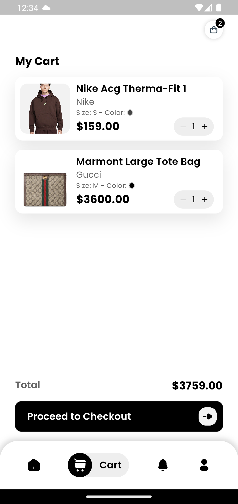
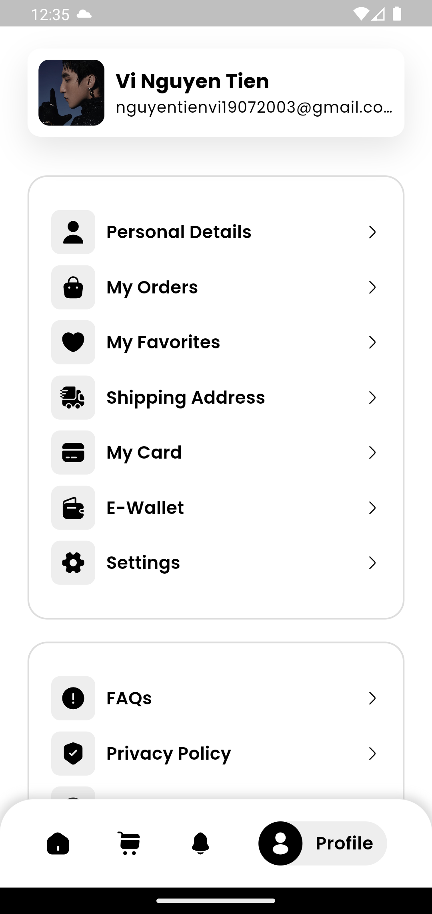

# E-commerce App

## Getting Started
This E-commerce App provides a platform for online shopping, including features such as product listing, shopping cart management, order placement,... It utilizes modern technologies for efficient performance and a user-friendly interface. The application is designed to be easy to navigate, providing users with a seamless shopping experience. The README file includes detailed information on how to install, run, and contribute to the project

<div style="display: flex; justify-content: space-around;">
  
  
  
  
</div>

## Installation
1. Clone the repo
   ```sh
   git clone https://github.com/iawtk2302/Ecommerce-App
   ```
2. Get packages
   ```sh
   flutter pub get
   ```
4. Run the project
   ```sh
   flutter run
   ```

## Contributors
* [Nguyễn Tuấn Khôi](https://github.com/iawtk2302)
* [Nguyễn Tiến Vĩ](https://github.com/vinguyen1907)

## Others
Admin App: https://github.com/vinguyen1907/Admin-Ecommerce-App
